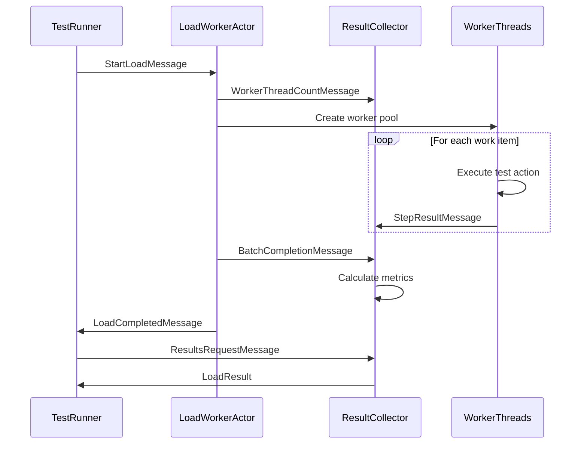
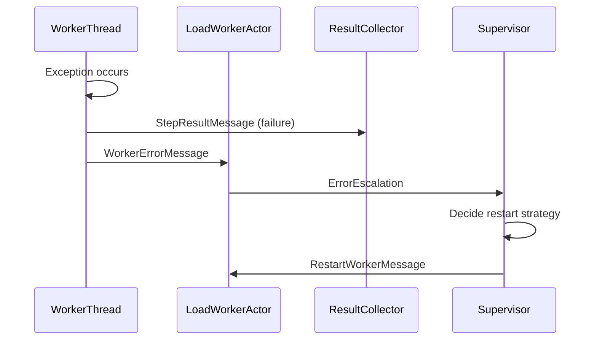

# Actor System Overview

The xUnitV3LoadFramework is built on the Akka.NET actor system, providing a distributed, fault-tolerant architecture for executing load tests at scale.

## 🎭 Actor Hierarchy

```
ActorSystem (LoadTestSystem)
├── TestRunner (Root Actor)
│   ├── LoadWorkerActorHybrid (Worker Coordinator)
│   │   ├── WorkerThread 1
│   │   ├── WorkerThread 2
│   │   └── WorkerThread N
│   └── ResultCollectorActor (Metrics Aggregator)
│       ├── LatencyTracker
│       ├── ThroughputCounter
│       └── ResourceMonitor
```

## Core Actors

### 1. LoadWorkerActorHybrid

**Purpose**: Orchestrates load test execution using hybrid channel-based workers

**Key Responsibilities**:
- Create and manage fixed worker thread pools
- Distribute work items through high-performance channels
- Monitor worker health and performance
- Coordinate test lifecycle (start, pause, stop)

**Message Types**:
```csharp
// Start load test execution
public class StartLoadMessage 
{
    public int Concurrency { get; set; }
    public int Duration { get; set; }
    public Func<Task<bool>> TestAction { get; set; }
}

// Report work completion
public class WorkerCompletionMessage 
{
    public int CompletedTasks { get; set; }
    public double AverageLatency { get; set; }
}

// Request current worker status
public class WorkerStatusRequest { }
```

### 2. ResultCollectorActor

**Purpose**: Aggregates and analyzes test results from all workers

**Key Responsibilities**:
- Collect step results from worker threads
- Calculate latency percentiles and throughput metrics
- Track resource utilization and system performance
- Generate comprehensive test reports

**Message Types**:
```csharp
// Individual test step result
public class StepResultMessage 
{
    public bool IsSuccess { get; set; }
    public double Latency { get; set; }
    public string Error { get; set; }
    public DateTime Timestamp { get; set; }
}

// Request for aggregated results
public class ResultsRequestMessage { }

// Worker thread count notification
public class WorkerThreadCountMessage 
{
    public int ThreadCount { get; set; }
}
```

## 📨 Message Flow Patterns

### Load Test Execution Flow



### Error Handling Flow



##  Actor Configuration

### Actor System Setup

```csharp
var config = ConfigurationFactory.ParseString(@"
    akka {
        actor {
            default-dispatcher {
                type = ThreadPoolDispatcher
                thread-pool-executor {
                    core-pool-size-min = 10
                    core-pool-size-factor = 2.0
                    core-pool-size-max = 100
                }
            }
        }
        
        load-test {
            worker-timeout = 30s
            result-collection-timeout = 60s
            batch-size = 1000
        }
    }
");

var system = ActorSystem.Create("LoadTestSystem", config);
```

### Dispatcher Configuration

The framework uses optimized dispatchers for different actor types:

**Load Worker Dispatcher**:
- **Type**: ThreadPoolDispatcher
- **Core Pool**: CPU cores * 2
- **Max Pool**: CPU cores * 4
- **Keep Alive**: 60 seconds

**Result Collector Dispatcher**:
- **Type**: SingleThreadDispatcher  
- **Dedicated Thread**: True
- **Mailbox**: UnboundedPriorityMailbox

## Fault Tolerance

### Supervision Strategy

```csharp
protected override SupervisorStrategy SupervisorStrategy() =>
    new OneForOneStrategy(
        maxNrOfRetries: 3,
        withinTimeRange: TimeSpan.FromMinutes(1),
        exception =>
        {
            return exception switch
            {
                TimeoutException => Directive.Restart,
                OutOfMemoryException => Directive.Stop,
                _ => Directive.Resume
            };
        });
```

### Error Recovery

1. **Worker Thread Failures**: Individual worker threads are restarted without affecting the pool
2. **Actor Failures**: Actors are restarted with preserved state where possible
3. **System Failures**: Graceful shutdown with result preservation

##  Lifecycle Management

### Actor Creation

```csharp
// Create load worker actor
var workerProps = Props.Create<LoadWorkerActorHybrid>()
    .WithDispatcher("load-worker-dispatcher");
var workerRef = system.ActorOf(workerProps, "load-worker");

// Create result collector
var collectorProps = Props.Create<ResultCollectorActor>()
    .WithDispatcher("result-collector-dispatcher");  
var collectorRef = system.ActorOf(collectorProps, "result-collector");
```

### Graceful Shutdown

```csharp
public async Task StopAsync()
{
    // Stop accepting new work
    await workerRef.Ask<Ack>(new StopMessage(), TimeSpan.FromSeconds(30));
    
    // Wait for current work to complete
    await collectorRef.Ask<LoadResult>(new FinalResultsMessage(), TimeSpan.FromSeconds(60));
    
    // Shutdown actor system
    await system.Terminate();
}
```

## Performance Characteristics

### Message Throughput

- **Load Workers**: 100K+ messages/second per worker
- **Result Collector**: 1M+ results/second aggregation
- **System Overhead**: < 5% CPU under typical load

### Memory Usage

- **Actor Overhead**: ~1KB per actor instance
- **Message Queues**: Bounded to prevent memory leaks
- **Result Storage**: Configurable retention policies

### Latency Profile

- **Message Delivery**: < 1ms P99 within same process
- **Result Aggregation**: < 10ms for 10K results
- **Test Coordination**: < 100ms test start/stop

##  Configuration Options

### Worker Pool Configuration

```json
{
  "loadTest": {
    "workerPool": {
      "minWorkers": 1,
      "maxWorkers": 100,
      "workerIdleTimeout": "30s",
      "workerCreationTimeout": "5s"
    }
  }
}
```

### Result Collection Configuration  

```json
{
  "resultCollection": {
    "batchSize": 1000,
    "flushInterval": "1s", 
    "maxBufferSize": "10MB",
    "retentionPolicy": "test-completion"
  }
}
```

##  Best Practices

### Message Design

1. **Immutability**: All messages should be immutable value objects
2. **Serialization**: Design for potential remote actor deployment
3. **Size Optimization**: Keep message payloads small and focused

### Actor Patterns

1. **Single Responsibility**: Each actor should have one clear purpose
2. **Stateless Workers**: Worker actors should be stateless for easy scaling
3. **Centralized State**: Use dedicated state management actors

### Performance Optimization

1. **Batching**: Group small messages into batches where possible
2. **Async Operations**: Use Ask() pattern sparingly, prefer Tell()
3. **Resource Cleanup**: Properly dispose resources in PostStop()

## 🔍 Monitoring and Debugging

### Built-in Metrics

```csharp
public class ActorMetrics
{
    public long MessagesProcessed { get; set; }
    public TimeSpan AverageProcessingTime { get; set; }
    public int MailboxSize { get; set; }
    public DateTime LastActivity { get; set; }
}
```

### Logging Integration

```csharp
public class LoadWorkerActorHybrid : ReceiveActor
{
    private readonly ILoggingAdapter _log = Context.GetLogger();
    
    protected override void PreStart()
    {
        _log.Info("LoadWorkerActor starting with {WorkerCount} workers", _workerCount);
        base.PreStart();
    }
}
```

### Debug Tools

1. **Actor Inspector**: Runtime actor hierarchy visualization
2. **Message Tracing**: Message flow debugging and profiling  
3. **Performance Counters**: Real-time actor performance metrics

##  Scaling Considerations

### Horizontal Scaling

The actor system is designed for horizontal scaling:

```csharp
// Deploy actors across multiple nodes
var clusterConfig = ConfigurationFactory.ParseString(@"
    akka.cluster {
        roles = [""load-worker"", ""result-collector""]
        seed-nodes = [
            ""akka.tcp://LoadTestSystem@node1:8080"",
            ""akka.tcp://LoadTestSystem@node2:8080""
        ]
    }
");
```

### Vertical Scaling

For single-node scaling:

```csharp
// Increase worker pool sizes
var workerRouter = system.ActorOf(
    Props.Create<LoadWorkerActorHybrid>()
        .WithRouter(new RoundRobinPool(Environment.ProcessorCount * 2)),
    "worker-pool"
);
```

## 🔮 Future Enhancements

### Planned Features

1. **Distributed Testing**: Multi-node load generation
2. **Dynamic Scaling**: Auto-scaling based on system metrics
3. **Plugin Architecture**: Custom actor implementations
4. **Advanced Routing**: Sophisticated message routing strategies

### Integration Opportunities

1. **Service Discovery**: Integration with service mesh technologies
2. **Observability**: OpenTelemetry and distributed tracing support
3. **Cloud Native**: Kubernetes-aware deployment patterns

The actor system architecture provides the foundation for scalable, fault-tolerant load testing that can grow with your performance testing needs.
