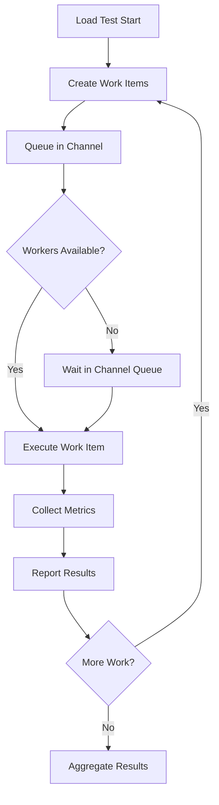

# Hybrid Load Worker Architecture

The Hybrid Load Worker represents a breakthrough in load testing performance, combining the predictability of fixed worker pools with the efficiency of channel-based communication.

## 🏗️ Architecture Overview

The Hybrid Load Worker (`LoadWorkerActorHybrid`) implements a channel-based execution model that provides:

- **Fixed Worker Pools**: Pre-allocated worker threads that remain constant throughout test execution
- **Channel-based Communication**: High-performance channels for work distribution
- **Resource Optimization**: Intelligent worker count calculation based on system resources
- **Comprehensive Metrics**: Real-time tracking of all performance indicators

## 📊 Performance Comparison

| Aspect | Traditional Task-based | Hybrid Channel-based |
|--------|----------------------|-------------------|
| Worker Creation | Dynamic per batch | Fixed pool (reused) |
| Memory Allocation | High (new tasks) | Low (pooled workers) |
| GC Pressure | Variable | Minimal |
| Throughput Consistency | Variable | Stable |
| Resource Predictability | Low | High |

## 🔧 Core Components

### 1. Worker Pool Management

```csharp
// Optimal worker count calculation
var coreCount = Environment.ProcessorCount;
var optimalWorkerCount = Math.Min(coreCount * 2, concurrency);
```

The hybrid worker calculates optimal worker thread counts based on:
- Available CPU cores
- Configured concurrency levels
- System resource constraints

### 2. Channel Architecture

```csharp
// High-performance channels for work distribution
private readonly Channel<WorkItem> _workChannel;
private readonly ChannelWriter<WorkItem> _writer;
private readonly ChannelReader<WorkItem> _reader;
```

Channels provide:
- **Lock-free Communication**: No mutex contention between producers and consumers
- **Bounded Queues**: Memory-safe work distribution with configurable limits
- **Backpressure Handling**: Automatic flow control when workers are saturated

### 3. Metrics Collection

The hybrid worker tracks comprehensive metrics:

```csharp
public class LoadResult
{
    // Request counts
    public int RequestsStarted { get; set; }
    public int Total { get; set; }
    public int Success { get; set; }
    public int Failure { get; set; }
    
    // Latency metrics (milliseconds)
    public double AverageLatency { get; set; }
    public double MinLatency { get; set; }
    public double MaxLatency { get; set; }
    public double MedianLatency { get; set; }
    public double Percentile95Latency { get; set; }
    public double Percentile99Latency { get; set; }
    
    // Throughput
    public double RequestsPerSecond { get; set; }
    
    // Queue performance
    public double AvgQueueTime { get; set; }
    public double MaxQueueTime { get; set; }
    
    // Resource utilization
    public int WorkerThreadsUsed { get; set; }
    public double WorkerUtilization { get; set; }
    public long PeakMemoryUsage { get; set; }
    public int BatchesCompleted { get; set; }
}
```

## 🚀 Execution Flow

### Phase 1: Initialization

1. **Worker Pool Creation**: Calculate optimal worker count and spawn fixed worker threads
2. **Channel Setup**: Create bounded channels for work distribution
3. **Metrics Initialization**: Set up result collection and tracking systems

### Phase 2: Work Distribution



### Phase 3: Result Aggregation

1. **Latency Analysis**: Calculate percentiles from collected timing data
2. **Throughput Calculation**: Determine requests per second from timing intervals
3. **Resource Reporting**: Report final memory usage and worker utilization
4. **Result Delivery**: Send comprehensive results to test framework

## 🔬 Technical Details

### Channel Configuration

```csharp
var options = new BoundedChannelOptions(capacity: concurrency * 2)
{
    FullMode = BoundedChannelFullMode.Wait,
    SingleReader = false,
    SingleWriter = true
};
```

Key configuration choices:
- **Bounded Capacity**: Prevents memory overflow under high load
- **Wait Mode**: Provides backpressure when workers are saturated  
- **Multi-Reader**: Allows multiple workers to consume from the same channel
- **Single Writer**: Load coordinator is the only producer

### Worker Thread Lifecycle

```csharp
private async Task WorkerLoop(ChannelReader<WorkItem> reader)
{
    await foreach (var workItem in reader.ReadAllAsync(_cancellationToken))
    {
        var stopwatch = Stopwatch.StartNew();
        
        try
        {
            // Execute the actual load test action
            var result = await workItem.Action();
            
            stopwatch.Stop();
            
            // Report successful completion
            _resultCollector.Tell(new StepResultMessage 
            { 
                IsSuccess = result, 
                Latency = stopwatch.Elapsed.TotalMilliseconds 
            });
        }
        catch (Exception ex)
        {
            stopwatch.Stop();
            
            // Report failure
            _resultCollector.Tell(new StepResultMessage 
            { 
                IsSuccess = false, 
                Latency = stopwatch.Elapsed.TotalMilliseconds,
                Error = ex.Message 
            });
        }
    }
}
```

### Memory Management

The hybrid approach minimizes memory allocation by:

1. **Worker Reuse**: Fixed worker threads are never destroyed
2. **Channel Reuse**: Work items flow through pre-allocated channel structures  
3. **Object Pooling**: Reuse of timing and result objects where possible
4. **Bounded Growth**: Channel capacity limits prevent unbounded memory growth

## 📈 Performance Characteristics

### Throughput Profile

The hybrid worker exhibits consistent throughput characteristics:

- **Linear Scaling**: Performance scales linearly with available CPU cores
- **Stable RPS**: Requests per second remains steady throughout test duration
- **No Warmup**: Immediate peak performance without ramp-up period

### Latency Distribution

Latency measurements show:
- **Consistent P99**: 99th percentile latency remains stable under load
- **Low Jitter**: Minimal variation in response times
- **Predictable Performance**: Results are reproducible across test runs

### Resource Utilization

- **CPU Efficient**: Minimal framework overhead
- **Memory Stable**: Bounded memory usage regardless of test duration
- **GC Friendly**: Low garbage collection pressure

## 🔧 Configuration Options

### Worker Pool Sizing

```csharp
[Load(concurrency: 1000, duration: 30000, interval: 1000)]
// Results in ~20 workers on a 10-core system (2x cores, capped at concurrency)
```

### Channel Capacity

Default capacity is `concurrency * 2` but can be customized for specific scenarios:
- **High-throughput**: Increase capacity for better buffering
- **Memory-constrained**: Decrease capacity to limit memory usage
- **Latency-sensitive**: Use smaller capacity for lower queue times

## 🎯 Use Cases

### Ideal Scenarios

1. **High-throughput Testing**: Sustained load over extended periods
2. **Resource-constrained Environments**: Limited memory or CPU resources  
3. **Consistency Requirements**: Need for predictable performance characteristics
4. **Long-running Tests**: Tests that execute for minutes or hours

### When to Consider Alternatives

1. **Low Concurrency**: < 10 concurrent requests (task-based may be simpler)
2. **Short Bursts**: Very brief test scenarios (< 1 second)
3. **Dynamic Scaling**: Requirements for runtime worker adjustment

## 📊 Metrics Deep Dive

### Worker Utilization Calculation

```csharp
// Worker utilization = (Total work time) / (Total worker time available)
WorkerUtilization = totalWorkTime / (workerCount * testDuration)
```

This metric indicates how effectively workers are being utilized:
- **> 90%**: Excellent utilization, workers are consistently busy
- **70-90%**: Good utilization with some idle time
- **< 70%**: Consider reducing worker count or increasing concurrency

### Queue Time Analysis

Queue times help identify bottlenecks:
- **Low Queue Time**: Workers keeping up with demand
- **High Queue Time**: Need more workers or reduced concurrency
- **Increasing Queue Time**: System reaching saturation point

## 🔍 Troubleshooting

### Performance Issues

1. **Low Throughput**: Check worker utilization and consider increasing worker count
2. **High Latency**: Examine queue times and system resource usage
3. **Memory Growth**: Verify channel capacity and check for memory leaks

### Common Pitfalls

1. **Over-provisioning Workers**: More workers than CPU cores can cause context switching overhead
2. **Under-sized Channels**: Too small capacity causes unnecessary blocking
3. **Ignoring Metrics**: Not monitoring worker utilization leads to suboptimal performance

## 🚀 Future Enhancements

### Planned Improvements

1. **Dynamic Worker Scaling**: Runtime adjustment of worker pool size
2. **Advanced Load Balancing**: Weighted work distribution based on worker performance
3. **Custom Channel Strategies**: Pluggable channel implementations for specific use cases
4. **Enhanced Monitoring**: Real-time dashboards and alerting

The Hybrid Load Worker represents the next evolution in load testing architecture, providing the performance and predictability needed for modern high-scale applications.
